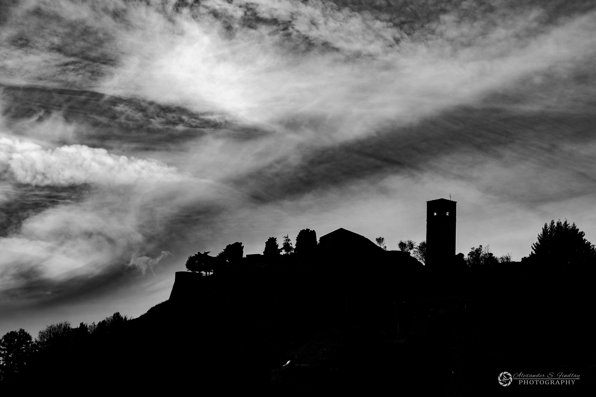

# Nikon D7500 Monochrome Showcase  

A collection of images taken with the Nikon D7500, showcasing part of my next monochrome exhibition.  

## 📸 Sample Images  

  
  
  
  

## 📌 Key Features  
- **📷 Sensor**: CMOS / APS-C (Not full-frame)  
- **🎨 Colour Depth**: 24.3-bit with excellent dynamic range  
- **📂 RAW Image Quality**: Supports 12 or 14-bit NEF (Nikon Electronic Format)  
- **🚀 Speed**: 8.2 fps continuous shooting  
- **🔆 ISO Range**: 100-51,200 (expandable)  

---  

### 🔗 Follow Me  
> If you like my work, check out my [Instagram](https://instagram.com/finphoto.il) & [Facebook](https://www.facebook.com/finphoto.il/)).  
